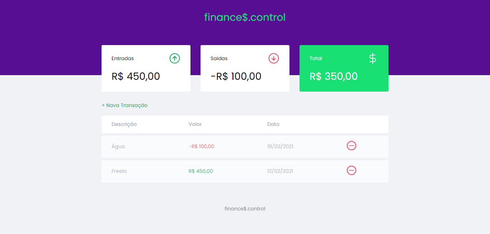

<h1 style="color: #19e073; text-align: center"> finance$.control </h1>

<a href="#project">Projeto</a> |
<a href="#tecnologies">Tecnologias</a> |
<a href="#layout">Layout</a> |
<a href="#license">Licença</a>
  

<h2 id="project"> 💻 Projeto  </h2>

Esse é um sistema de controle financeiro onde o usuário pode adicionar, remover e obter um balanço geral de suas finanças. A proposta e layout foram desenvolvidos durante a "Maratona Discover" feita pela Rocketseat, eu apenas fiz alterações de acordo com a minha preferência. 

 

<h2 id="tecnologies"> ✨ Tecnologias </h2>
<li> HTML5 </li>
<li> CSS3 </li>
<li> JAVASCRIPT </li>
 
<h2 id="layout"> 🎨 Layout </h2>

 Clique <a href="https://www.figma.com/file/7Vu9DzUaCZIV4nibzkjgB4/dev.finance%24-Maratona-Discover"> aqui </a> para ver o layout original no Figma.

 
<h2 id="license"> 📑 Licença </h2>

 Esse projeto está sob licença MIT. Veja o arquivo <a href="./LICENSE"> LICENSE </a> para mais detalhes.

Feito por <a href="https://www.linkedin.com/in/beatrizliragonzaga/"> Beatriz Lira </a> 🎈
